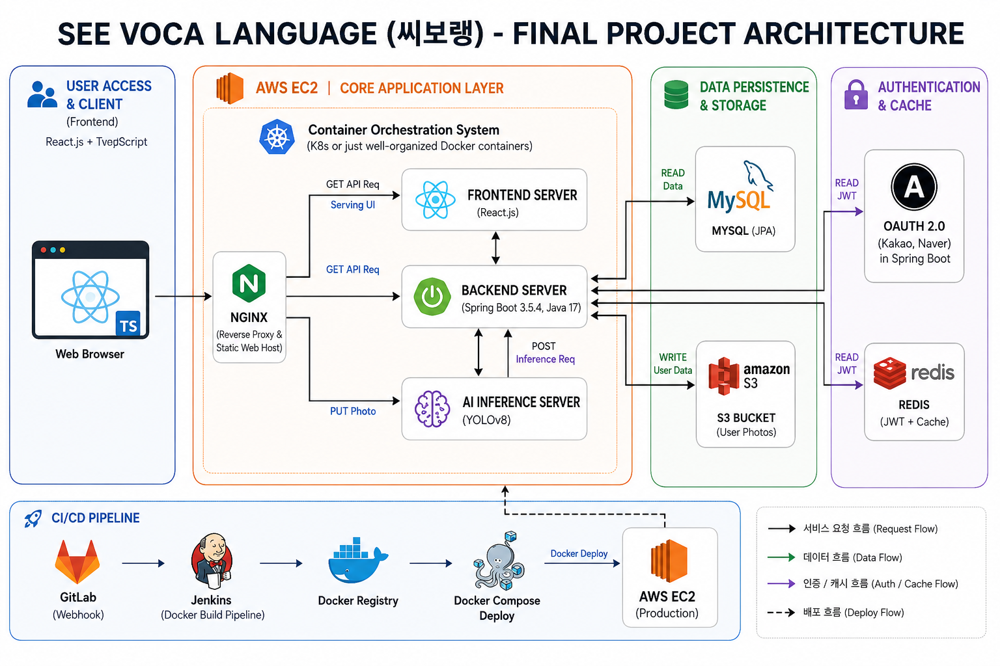
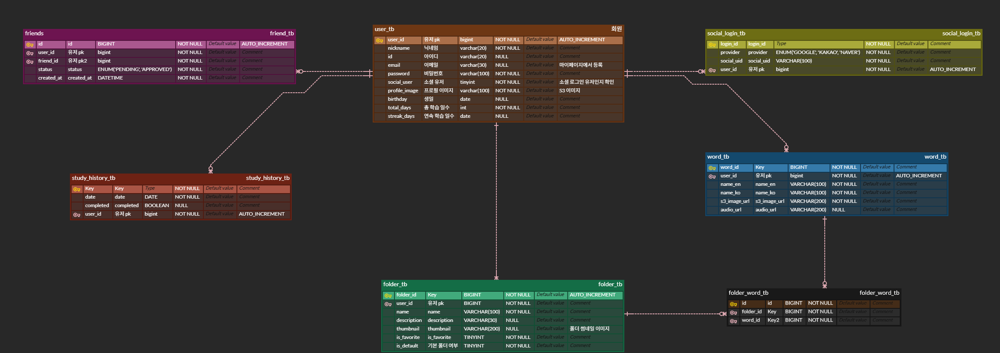

# 🔠 씨보랭 (See Voca Language) 
> 2025.07.07 ~ 2025.08.18

## 👥 팀 소개
- 팀명: 1중대
- 백엔드 3명 + 프론트엔드 3명

## 📘 프로젝트 개요
**영어 단어 학습 웹앱**

Yolo 모델 객체인식을 활용하여, 사용자가 사진을 업로드하면 사진 속 물체를 인식하여 영어 단어를 알려주고 학습할 수 있는 서비스입니다. 

영어 학습 경험이 거의 없는 사용자를 타깃으로 하는 만큼

직관적인 UI, 학습 기록 스트릭, 학습 게임 등의 기능을 통해 일상 속에서 친숙하고 재미있게 영어 단어를 익힐 수 있도록 구성하였습니다.

## ✨ 주요 기능

### 1. 객체 인식 기반 단어 학습
- 이미지 업로드
- YOLOv8 객체 인식 기반 영어 단어 추천

### 2. 단어장 기능
- 단어 저장
- 폴더별 관리

### 3. 사용자 인증
- JWT 기반 인증/인가
- Redis Refresh Token 관리
- OAuth2 카카오/네이버 로그인
- 이메일 인증

### 4. 학습 유도 시스템
- 스트릭 기록
- 퀴즈/게임 기반 복습

## 🎯 사용 플로우

1. 사용자가 사진 업로드
2. AI가 객체 인식하여 매핑된 영어 단어 제시
3. 사용자 단어장에 추가
4. 학습 게임, 퀴즈 등으로 복습
5. 학습 기록이 쌓일 때마다 스트릭을 갱신하여 꾸준한 학습 독려

## 😎 담당 역할
### Backend
- OAuth2.0 카카오/네이버 소셜 로그인
- JWT + Redis 기반 인증·인가 처리
- 이메일 인증

### Infra
- Nginx Reverse Proxy를 활용한 프론트 서버 배포 및 연동
- Jenkins Gitlab Webhook 기반 CI/CD
- Docker Compose를 통한 통합 관리 환경 구축

## 🛠 기술 스택

| 항목 | 사용 기술                                           |
| -- |-------------------------------------------------|
| 프론트엔드 | React.js, TypeScript                            |
| 백엔드 | JDK 17, Spring Boot 3.5.4, OAuth2.0             |
| 데이터 관리 | MySQL, JPA, Redis, S3                           |
| AI | YOLOv8                                          |
| 인프라 | AWS EC2, Docker, Docker Compose, Jenkins, Nginx |
| 협업 도구 | GitLab, Notion, Jira                            |

## ⚙️ 아키텍처

## 💾 ERD

## 🔥 Technical Decision

### JWT + Redis 기반 인증

학습 서비스 특성상 사용 흐름이 자주 끊기면 사용자의 흥미 상실 및 서비스 이탈 가능성이 높다고 판단했습니다.

반면, 사진 업로드 기능이 포함되어 있어 Access Token의 TTL을 과도하게 길게 설정하는 것은 보안 측면에서 적절하지 않았습니다.

따라서:
- Access Token은 5분의 짧은 TTL 적용
- Refresh Token은 Redis에 저장하여 서버 측 검증 수행
- 토큰 재발급 로직을 통해 로그인 유지

구조를 적용하여 보안성과 사용자 경험을 해치지 않는 인증 방식을 구성했습니다.

## 🏹 Trouble Shooting
